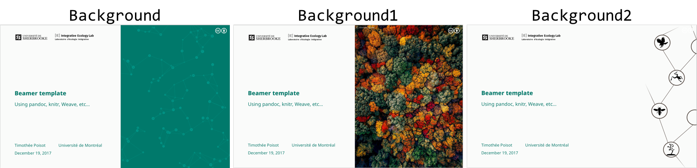

## Presentation template - ieLab

Beamer template based in `markdown`/`LateX` language for the Integrative Ecology Lab. Based in the Poisot lab [template](https://github.com/PoisotLab/PLPT).

## Title page
There are three background images ready so far you can change in the `YAML` background:

To add other images you can use this template [here](background/background_template.pdf).
To change the font color of the title page you can change [here](https://github.com/TheoreticalEcosystemEcology/PLPT/blob/4c8d39df17910092dbe98ca2fe439105457ace58/beamerthemepl.sty#L72) and [here](https://github.com/TheoreticalEcosystemEcology/PLPT/blob/4c8d39df17910092dbe98ca2fe439105457ace58/template/pl.tex#L94). The current color is `plST`: #00796B.

## Columns

~~~ latex
\begincols
\column{0.48\textwidth}

Column 1

\hfill\column{0.48\textwidth}

Column 2

\stopcols
~~~
